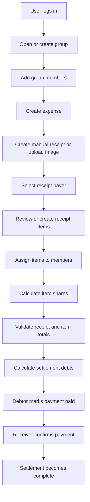
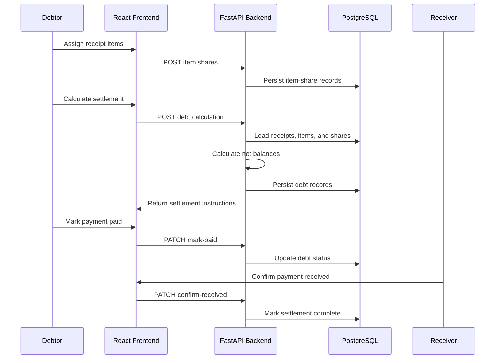
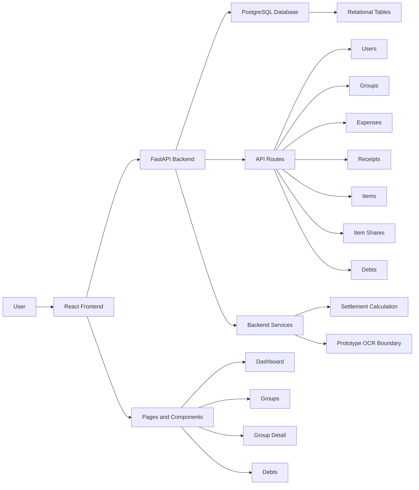
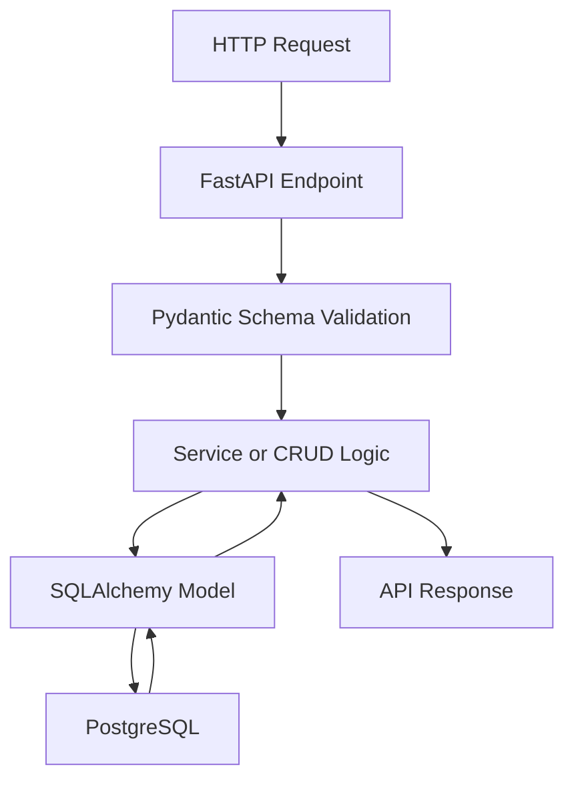
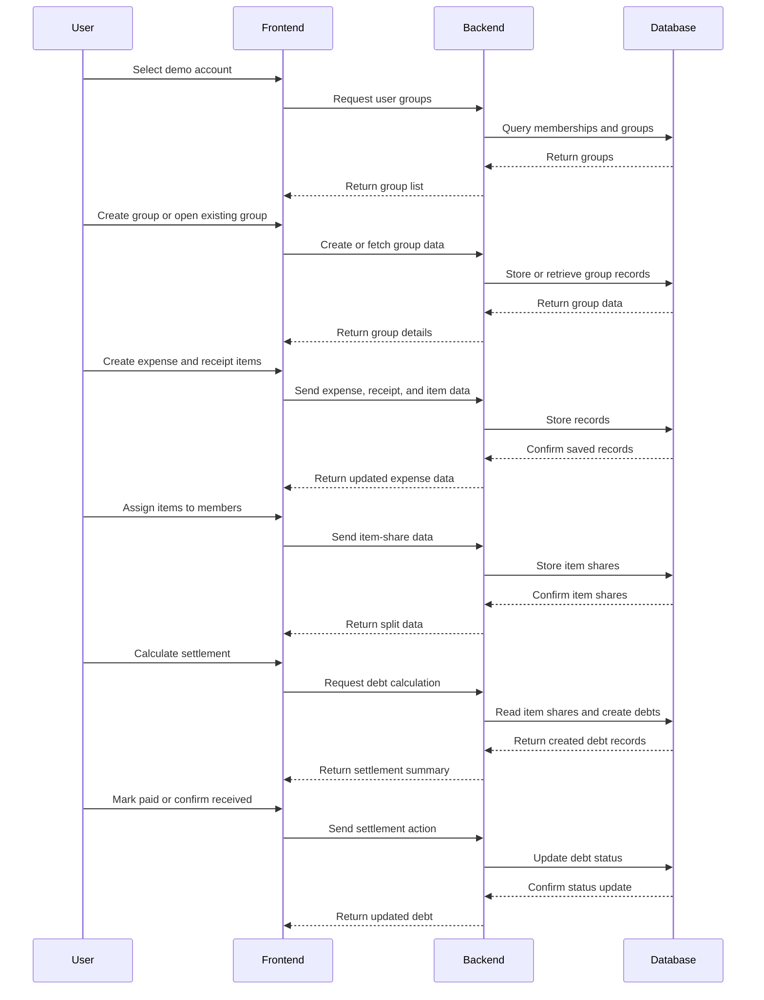
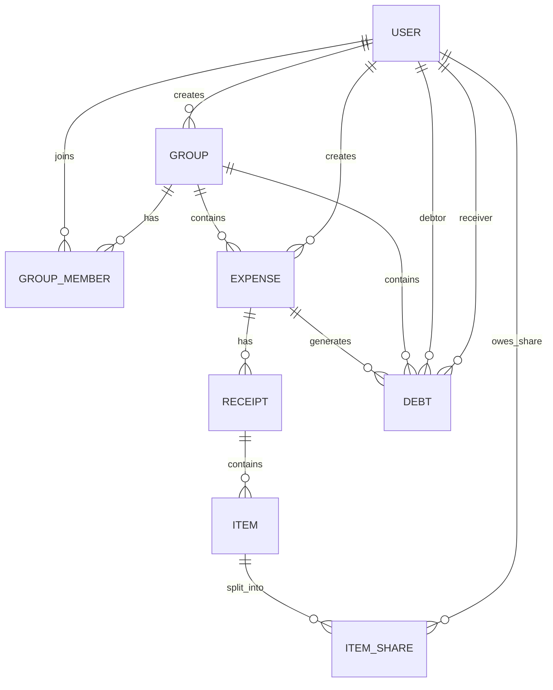

# O(n) Debtor

O(n) Debtor is a mobile-first shared-expense web application that helps groups record receipts, assign individual items, calculate debts, and track settlement payments.

| Field | Value |
|---|---|
| Team Number | 6634 |
| Team Members | Chen Sixian, Sun Jingyi |
| Level of Achievement | Apollo 11 |
| Current Milestone | Milestone 2 - Prototyping |
| Milestone 2 Deadline | 29 June 2026 |
| Repository | [dfs-orbital-2026](https://github.com/Arand0mjos3f/dfs-orbital-2026) |

## Project Links

- [Project Log](https://docs.google.com/spreadsheets/d/1Ie5eU-z8m25OljnVfuN1kPPhWBSeRJz_ml7taz97yeE/edit?usp=sharing)
- [Milestone 1 Poster](https://drive.google.com/file/d/1Uum69-sMhQZYtqlU7TS2U6kFbE41KS93/view?usp=sharing)
- [API Contract](docs/api_contract.md)
- [Database ERD](docs/database_erd.md)
- [Testing Strategy](docs/testing_strategy.md)
- Milestone 2 poster: to be added before submission
- Milestone 2 video: to be added before submission

## Table of Contents

1. Project Overview
2. Motivation
3. Target Users
4. User Stories
5. Level of Achievement
6. Milestone 1 Summary
7. Milestone 2 Prototype
8. Core Workflow
9. Feature Details and Complexity
10. Technology Stack
11. System Architecture
12. Database Design
13. API Design
14. Frontend Design
15. Design Principles and Patterns
16. Design Decisions
17. Coding Standards
18. Testing Strategy
19. Problems Encountered
20. Software Engineering Evidence
21. GitHub Workflow
22. Evidence Gallery
23. Setup Instructions
24. Demo Accounts
25. Known Limitations
26. Team Responsibilities
27. Roadmap
28. Milestone 2 Deliverables

## 1. Project Overview

O(n) Debtor is a full-stack web application for managing shared group expenses. It provides a structured workflow for creating groups, recording expenses, entering or uploading receipts, assigning items to participants, calculating settlement debts, and confirming that payments have been completed.

The application follows a client-server architecture:

- React provides the mobile-first frontend.
- FastAPI provides the REST API.
- PostgreSQL provides persistent relational storage.
- SQLAlchemy provides database access.
- Alembic manages database migrations.
- Zustand manages shared frontend state.
- Axios connects the frontend to the backend.

The project name combines two ideas:

- `O(n)` reflects the team's focus on efficient computation.
- `Debtor` reflects the application's expense and settlement domain.

Debt-First Search, abbreviated as DFS, is also used as the identity of the settlement engine.

## 2. Motivation

University students frequently share expenses for:

- Meals.
- Transport.
- Groceries.
- Hall activities.
- Project resources.
- Subscriptions.
- Travel.

Manual tracking is slow and error-prone. A single group may have several receipts, different payers, shared items, taxes, service charges, and many small debts. These micro-debts become difficult to understand and settle.

Traditional expense-sharing workflows often require users to enter a single total and divide it equally. This is insufficient when different participants consume different receipt items.

O(n) Debtor addresses this problem through an item-level workflow:

1. Create a group.
2. Record an expense.
3. Create or upload a receipt.
4. Review receipt items.
5. Assign each item to the relevant participants.
6. Calculate each participant's share.
7. Generate settlement instructions.
8. Track payment confirmation.

## 3. Target Users

The primary target users are:

- NUS students splitting meals and transport.
- Hall residents sharing groceries or supper.
- Project teams sharing subscriptions and resources.
- Travel groups managing multiple receipts.
- Friend groups tracking recurring shared payments.

The prototype prioritises small groups using mobile devices in informal social settings.

## 4. User Stories

- As a user, I can log in so that I can access my groups and debts.
- As a user, I can create a group so that I can organise shared expenses.
- As a group owner, I can edit or delete my group.
- As a group owner, I can add registered users as members.
- As a group member, I can view groups that I belong to.
- As a group member, I can create an expense.
- As a group member, I can select the payer of a receipt.
- As a group member, I can enter receipt items manually.
- As a group member, I can assign an item to one or more members.
- As a group member, I can preview the equal split for an item.
- As a user, I can detect when item totals do not match a receipt total.
- As a group member, I can calculate who should pay whom.
- As a debtor, I can mark a payment as paid.
- As a receiver, I can confirm that a payment was received.
- As a user, I can view my outstanding balances on the dashboard.

## 5. Level of Achievement

The team is targeting **Apollo 11**.

The project justifies this target through:

- A full-stack React, FastAPI, PostgreSQL, SQLAlchemy, and Alembic architecture.
- Eight connected functional areas of meaningful complexity.
- Mobile-first frontend design.
- Normalised relational data modelling.
- REST API design and Swagger documentation.
- Group ownership and membership permissions.
- Item-level receipt splitting.
- Automated debt calculation.
- Multi-user settlement state transitions.
- Unit, integration, and system testing.
- Git branches, commits, issues, milestones, and pull requests.
- Cumulative documentation from Milestone 1 and Milestone 2.
- Explicit design principles, patterns, decisions, and coding standards.

The project is not evaluated only by the number of screens. Its complexity comes from coordinating financial data across users, groups, expenses, receipts, items, shares, debts, and payment states.

## 6. Milestone 1 Summary

Milestone 1 focused on ideation, architecture, technical setup, and an integrated proof of concept.

Completed Milestone 1 work included:

- Project motivation and target-user analysis.
- User-story definition.
- React and Vite frontend setup.
- FastAPI backend setup.
- PostgreSQL database connection.
- SQLAlchemy models.
- Alembic migrations.
- React Router configuration.
- Axios API client.
- Zustand authentication and group stores.
- Protected frontend routes.
- Group creation and listing.
- Group detail routing.
- Group editing and deletion.
- Swagger/OpenAPI documentation.
- API contract design.
- Database ERD.
- GitHub issues, labels, milestones, branches, and pull requests.
- Initial system-testing plan.

The Milestone 1 proof of concept demonstrated that the frontend, backend, and database could communicate successfully.

## 7. Milestone 2 Prototype

Milestone 2 focuses on implementing the application's essential end-to-end workflow.

### Implemented Prototype Features

- Two-user prototype login for Sixian and Jingyi.
- User-aware dashboard data.
- Group creation, listing, editing, and deletion.
- Owner-only group-management controls.
- Group membership management.
- Expense creation and listing.
- Manual receipt creation.
- Receipt payer selection.
- Manual item creation.
- Receipt image-upload API.
- Mock OCR service boundary.
- Item assignment to group members.
- Equal item splitting with cent-level remainder handling.
- Saved item-share records.
- Receipt-total and item-total comparison.
- Debt calculation from item shares and receipt payers.
- Settlement summary.
- Mark-paid workflow.
- Confirm-received workflow.
- Persistent debt statuses.
- Persistent Debts-page group selection.
- Frontend unit tests.
- Backend integration tests.
- Manual browser system testing.

### OCR Prototype Status

The backend currently provides a receipt-upload endpoint that:

1. Accepts an image file.
2. Validates the file type.
3. Stores the uploaded image.
4. Passes the image path to an OCR-service boundary.
5. Returns structured receipt and item data.

The current OCR service returns deterministic mock results. This validates the upload and parsing contract without claiming that production PaddleOCR integration is complete.

The mock service can later be replaced with PaddleOCR without changing the receipt-upload endpoint contract.

## 8. Core Workflow

The Milestone 2 prototype supports this workflow:



### Settlement Sequence



## 9. Feature Details and Complexity

The Milestone 2 prototype is organised into six substantial feature groups.

Complexity is quantified using:

- Number of persistent entities involved.
- Number of backend endpoints involved.
- Number of frontend views and states involved.
- Cross-layer coordination between frontend, backend, and database.
- Financial calculation and permission requirements.
- Automated and system-test coverage.

No arbitrary numerical complexity score is used.

| Feature Group | Quantifiable Scope | Complexity Justification | Status |
|---|---|---|---|
| Users, groups, membership, and permissions | 3 entities, 9 user/group endpoints, owner/member roles | Many-to-many membership, role enforcement, user-aware views | Implemented |
| Expenses, receipts, and items | 3 entities, 13 endpoints, 3-level hierarchy | Nested persistence, payer selection, manual and uploaded receipts | Implemented |
| Receipt upload and OCR boundary | 1 multipart endpoint, file validation, storage, service boundary | Asynchronous file workflow and parsing contract | Mock OCR prototype |
| Item assignment and equal splitting | 1 entity, 4 endpoints, multiple users per item | Many-to-many allocation, cent rounding, persistent shares | Implemented |
| Expense-level debt calculation | 1 entity, net-balance calculation, debtor-creditor matching | Financial correctness and algorithmic settlement generation | Implemented |
| Settlement tracking and visualisation | 3 debt states, 2 permission-controlled actions, 3 frontend views | Multi-user state transitions and persistent status | Implemented |

Supporting engineering functionality includes:

- Receipt-total validation.
- Loading and error states.
- Persistent frontend selection.
- Automated unit tests.
- Automated integration tests.
- Manual system testing.

### 9.1 Users, Groups, Membership, and Permissions

This feature group contains:

- `users`
- `groups`
- `group_members`

The backend exposes two user endpoints and seven group-related endpoints.

Implemented behaviour:

- Register prototype users.
- List registered users.
- Create groups.
- List groups belonging to the logged-in user.
- View group details.
- Edit owned groups.
- Delete eligible owned groups.
- Add registered members.
- List group members.
- Map user IDs to display names.
- Distinguish owners from members.
- Hide owner-only controls from non-owners.
- Reject unauthorised operations through backend permission checks.

The `group_members` table resolves the many-to-many relationship between users and groups.

Authentication remains a frontend prototype. The application does not yet provide production token authentication.

### 9.2 Expenses, Receipts, and Items

This feature group contains:

- `expenses`
- `receipts`
- `items`

The backend exposes four expense endpoints, five receipt endpoints, and four item endpoints.

An expense belongs to one group. An expense can contain multiple receipts, and each receipt can contain multiple items.

Implemented behaviour:

- Create an expense inside a group.
- Store the expense creator and draft status.
- List expenses belonging to a group.
- Create a manual receipt.
- Select one payer for each receipt.
- Store subtotal, tax, service charge, and total.
- List receipts belonging to an expense.
- Create receipt items.
- Store item name, quantity, unit price, and total price.
- Switch between multiple receipts.
- Preserve records in PostgreSQL after refresh.

The three-level `expense -> receipt -> item` hierarchy creates cross-layer complexity because each frontend action must preserve the correct parent-child identifiers.

### 9.3 Receipt Upload and OCR Boundary

The backend provides one multipart receipt-upload endpoint.

The upload workflow:

1. Receives an expense ID, payer ID, and image file.
2. Verifies that the expense exists.
3. Verifies that the payer exists.
4. Rejects non-image files.
5. Generates a unique filename.
6. Stores the image under the receipt-upload directory.
7. Passes the saved image path to an OCR-service boundary.
8. Creates a receipt using the returned totals.
9. Returns raw OCR text and structured item suggestions.

The current OCR service is deterministic mock OCR. It returns fixed item suggestions and raw text so that the upload contract can be integrated and tested.

The prototype does not claim production PaddleOCR accuracy. Replacing the mock service with PaddleOCR remains future work.

### 9.4 Item Assignment and Equal Splitting

This feature group uses the `item_shares` entity and four item-share endpoints.

Each item can be assigned to one or more users. Each user receives an independent item-share record.

Implemented behaviour:

- Load group members.
- Select multiple users for an item.
- Divide an item total equally.
- Convert money into integer cents before division.
- Distribute remainder cents deterministically.
- Create item-share records.
- Load saved item shares.
- Display participant names and share amounts.
- Prevent repeated assignment in the completed frontend state.
- Enforce one share per user and item through a database constraint.
- Validate that each share's components equal its total.

Example:

```text
Item total: 10.00
Number of users: 3
Calculated shares: 3.34, 3.33, 3.33
Final sum: 10.00

### 9.5 Expense-Level Debt Calculation

Debt calculation uses:

- Receipt payer records.
- Item-share records.
- The `debts` entity.
- Debt calculation and retrieval endpoints.

For each receipt:

1. Every assigned share reduces that participant's net balance.
2. The receipt payer receives credit for the assigned total.
3. Positive balances become creditors.
4. Negative balances become debtors.
5. A greedy matching process pairs debtors with creditors.
6. The generated payment instructions are stored as debt records.

Example:

```text
Receipt payer: Sixian
Assigned total: 10.00
Sixian share: 5.00
Jingyi share: 5.00
Generated debt: Jingyi pays Sixian 5.00

### 9.6 Settlement Tracking and Visualisation

Settlement tracking uses four debt statuses:

- `pending`
- `marked_paid`
- `confirmed_received`
- `cancelled`

The active payment flow is:

```text
pending -> marked_paid -> confirmed_received
```

The permission rules are:

- Only the debtor can mark a pending debt as paid.
- Only the receiver can confirm a marked payment.
- Invalid state transitions are rejected.
- Completed settlements remain persisted for history.

Settlement data appears in three frontend views:

- Dashboard
- Group Detail
- Debts

The Dashboard summarises amounts owed by and owed to the logged-in user.

The Group Detail page displays outstanding settlement instructions generated from the group's expenses.

The Debts page:

- Allows users to select a group.
- Displays pending and completed settlements.
- Shows actions based on the logged-in user's role.
- Preserves the selected group after browser refresh.

### 9.7 Supporting Engineering Functionality

The prototype also includes supporting engineering functionality that makes the main features usable and maintainable.

This functionality is not counted as a separate core feature group, but it supports the implementation and evidence required for Apollo 11.

Implemented support includes:

- Reusable frontend API modules for users, groups, expenses, item shares, and debts.
- Shared frontend state for authenticated user data.
- Persistent selected-group state on the Debts page.
- Backend CRUD helpers for reusable database operations.
- Swagger documentation generated from FastAPI routes.
- Alembic migration support for database schema versioning.
- Automated frontend unit tests for receipt-total calculation.
- Automated backend integration test for the settlement lifecycle.
- Manual system testing across the full prototype workflow.

This support helps the project show intermediate version control, testing evidence, API clarity, and maintainable implementation structure.

## 10. Technology Stack

The project uses a React frontend, FastAPI backend, and PostgreSQL database. This stack was chosen because it supports fast prototyping while still giving the team enough structure to build maintainable API routes, database models, frontend views, and automated tests.

| Layer | Technology | Purpose |
|---|---|---|
| Frontend | React | Builds the user interface as reusable components. |
| Frontend | Vite | Provides a fast local development server and production build process. |
| Frontend | Tailwind CSS | Provides utility-first styling for the mobile-first prototype interface. |
| Frontend | React Router | Handles navigation between Dashboard, Groups, Group Detail, Debts, and Login pages. |
| Frontend | Zustand | Stores shared frontend state such as authenticated user information and selected group data. |
| Frontend | Axios | Sends HTTP requests from the frontend to the backend API. |
| Backend | FastAPI | Provides REST API routes for users, groups, expenses, receipts, items, shares, and debts. |
| Backend | Uvicorn | Runs the FastAPI application during development. |
| Backend | Pydantic | Validates request and response data. |
| Backend | SQLAlchemy | Maps Python models to database tables and handles database queries. |
| Backend | Alembic | Manages database schema migrations. |
| Database | PostgreSQL | Stores users, groups, memberships, expenses, receipts, items, item shares, and debts. |
| Testing | ESLint | Checks frontend code quality and catches common React issues. |
| Testing | Node test runner | Runs frontend unit tests for receipt-total calculations. |
| Testing | Pytest | Runs backend integration tests for settlement workflows. |
| Documentation | Swagger / OpenAPI | Provides generated API documentation from FastAPI. |
| Documentation | README and Project Log | Records features, design decisions, testing evidence, and team contributions. |
| Version Control | Git and GitHub | Supports branching, commits, pull requests, issues, milestones, and collaboration. |

### 10.1 Frontend Stack

The frontend is implemented using React because the prototype has multiple interactive views that can be broken down into reusable components. Examples include group cards, member controls, expense cards, receipt item controls, receipt-total feedback, and settlement actions.

Vite is used because it gives fast local development feedback. This is useful during prototyping because the team frequently needs to test UI changes, API integration, and browser behaviour.

Tailwind CSS is used to keep styling consistent across the mobile-first interface. It allows the team to build visually consistent screens without maintaining many separate CSS files.

React Router is used because the prototype has multiple pages:

- Login
- Dashboard
- Groups
- Group Detail
- Debts

Zustand is used for lightweight frontend state management. It helps store shared state such as the selected authenticated user and group data without introducing a larger state-management framework.

Axios is used to centralise HTTP requests to the backend API. This makes frontend API calls easier to reuse and easier to update when backend routes change.

### 10.2 Backend Stack

The backend is implemented using FastAPI because it supports typed request validation, clean route definitions, and automatic Swagger documentation. This helps the team test routes manually during development and show clear API evidence for Milestone 2.

Uvicorn is used as the local ASGI server for running the FastAPI app during development.

Pydantic is used to validate incoming request bodies and outgoing response structures. This helps reduce invalid data entering the backend.

SQLAlchemy is used to define database models and query the PostgreSQL database. It gives the backend a structured way to work with relational data.

Alembic is used for schema migration. This is important because the project contains many related tables, and database schema changes need to be tracked properly across development.

### 10.3 Database Stack

PostgreSQL is used because O(n) Debtor is a relational-data-heavy application. The system needs to model relationships between:

- Users
- Groups
- Group memberships
- Expenses
- Receipts
- Receipt items
- Item shares
- Debts

PostgreSQL is suitable because the project needs persistent storage, foreign-key relationships, and reliable financial records.

### 10.4 Testing Stack

The testing stack includes both automated testing and manual system testing.

Frontend tests use the Node test runner to verify pure calculation logic such as receipt-total matching. This keeps the tests lightweight and fast.

Backend tests use Pytest to verify the settlement calculation and payment lifecycle through backend service and database behaviour.

ESLint is used to catch frontend code-quality issues before commits. It has already helped identify React hook problems during Milestone 2.

Manual system testing is used to test the full user workflow across frontend, backend, and database.

## 11. System Architecture

O(n) Debtor uses a client-server architecture with a React frontend, FastAPI backend, and PostgreSQL database.

The frontend is responsible for user interaction, form input, navigation, and displaying settlement information. The backend is responsible for validating requests, enforcing business rules, calculating settlements, and storing persistent records. The database stores the project data in relational tables.



### 11.1 Frontend Architecture

The frontend is organised around pages, reusable components, API modules, and shared state.

The main frontend pages are:

- Login
- Dashboard
- Groups
- Group Detail
- Debts

The main reusable components include:

- Add member form
- Expense receipt item controls
- Receipt total status feedback
- Group and expense display sections
- Settlement action controls

The frontend API modules separate HTTP requests from the page components. This keeps the page files focused on user interaction and display logic.

Current frontend API modules include:

- Users API
- Groups API
- Expenses API
- Receipts API
- Items API
- Item shares API
- Debts API

Shared frontend state is used for prototype authentication and selected user data. This allows the app to show different controls depending on whether the logged-in user is the group owner, debtor, or receiver.

### 11.2 Backend Architecture

The backend follows a layered structure.

The main backend layers are:

- API endpoints
- Schemas
- CRUD helpers
- Models
- Services
- Database session management

API endpoints receive requests from the frontend and return structured responses.

Schemas validate request and response data.

Models define the database tables.

CRUD helpers handle reusable database operations.

Services contain business logic such as settlement calculation and OCR-related prototype behaviour.

Database session management connects backend routes and services to PostgreSQL.



### 11.3 Database Architecture

The database is relational because the app needs to preserve relationships between users, groups, expenses, receipt items, item shares, and debts.

The main data relationships are:

- A user can belong to many groups.
- A group can have many members.
- A group can have many expenses.
- An expense can have many receipts.
- A receipt can have many items.
- An item can be shared by many users.
- A calculated debt connects one debtor to one receiver.
- A group can have many debts across its expenses.

This structure supports item-level splitting and settlement tracking while preserving the history of expenses and payments.

### 11.4 Main Prototype Workflow

The main Milestone 2 workflow connects the frontend, backend, and database.



### 11.5 Architecture Rationale

This architecture was chosen because it keeps responsibilities separated.

The frontend focuses on:

- User interaction
- Form state
- Page navigation
- Displaying group, receipt, and settlement data

The backend focuses on:

- Data validation
- Permission checks
- Database persistence
- Settlement calculation
- API documentation

The database focuses on:

- Persistent records
- Relational links
- Settlement history

This separation makes the prototype easier to test, debug, document, and extend for Milestone 3.

## 12. Database Design

The database is designed around the main objects in the expense-sharing workflow:

- Users
- Groups
- Group memberships
- Expenses
- Receipts
- Receipt items
- Item shares
- Debts

The schema is relational because the application needs to preserve ownership, membership, expense history, item-level assignment, and settlement status.

### 12.1 Entity Relationship Overview



### 12.2 Main Tables

| Table | Purpose |
|---|---|
| `users` | Stores user profile and login-related prototype data. |
| `groups` | Stores group information such as name, description, and creator. |
| `group_members` | Links users to groups and stores roles such as owner or member. |
| `expenses` | Stores expense records created inside a group. |
| `receipts` | Stores receipt-level data attached to an expense. |
| `items` | Stores individual receipt items and their prices. |
| `item_shares` | Stores which users are assigned to each item and how much they owe. |
| `debts` | Stores calculated settlement instructions between users. |

### 12.3 Users

The `users` table stores the people who can participate in groups and settlements.

Important fields include:

| Field | Purpose |
|---|---|
| `id` | Unique identifier for the user. |
| `username` | Display name shown in the frontend. |
| `email` | User email used by the prototype login flow. |
| `password_hash` | Stores password-related data for the prototype. |
| `avatar_url` | Optional avatar image URL. |
| `created_at` | Records when the user was created. |

In Milestone 2, the authentication flow is still a prototype flow. The users table is still important because it allows the app to test real multi-user group and settlement behaviour.

### 12.4 Groups

The `groups` table stores expense-sharing groups.

Important fields include:

| Field | Purpose |
|---|---|
| `id` | Unique identifier for the group. |
| `name` | Group name shown in the frontend. |
| `description` | Optional group description. |
| `created_by_id` | User who created the group. |
| `created_at` | Records when the group was created. |
| `updated_at` | Records when the group was last updated. |

Groups are the main container for expenses, members, and debts.

### 12.5 Group Members

The `group_members` table links users to groups.

Important fields include:

| Field | Purpose |
|---|---|
| `id` | Unique identifier for the membership record. |
| `group_id` | Group that the user belongs to. |
| `user_id` | User who belongs to the group. |
| `role` | User's role in the group, such as owner or member. |
| `joined_at` | Records when the user joined the group. |

This table allows the system to support multiple users in one group and role-based controls. For example, only the group owner can add members in the current prototype.

### 12.6 Expenses

The `expenses` table stores expenses created inside groups.

Important fields include:

| Field | Purpose |
|---|---|
| `id` | Unique identifier for the expense. |
| `group_id` | Group that owns the expense. |
| `title` | Expense title. |
| `description` | Optional expense description. |
| `created_by_id` | User who created the expense. |
| `status` | Expense state such as draft. |
| `created_at` | Records when the expense was created. |
| `updated_at` | Records when the expense was last updated. |

Expenses connect group activity to receipt data and settlement calculation.

### 12.7 Receipts

The `receipts` table stores receipt-level data for an expense.

Important fields include:

| Field | Purpose |
|---|---|
| `id` | Unique identifier for the receipt. |
| `expense_id` | Expense that the receipt belongs to. |
| `merchant_name` | Optional merchant name. |
| `total_amount` | Receipt total amount. |
| `receipt_date` | Optional receipt date. |
| `image_url` | Optional receipt image reference. |
| `ocr_status` | Status of OCR processing. |
| `created_at` | Records when the receipt was created. |
| `updated_at` | Records when the receipt was last updated. |

In Milestone 2, manual receipt entry and mock OCR boundary behaviour are included. Full production OCR accuracy is not yet claimed.

### 12.8 Items

The `items` table stores individual receipt items.

Important fields include:

| Field | Purpose |
|---|---|
| `id` | Unique identifier for the item. |
| `receipt_id` | Receipt that the item belongs to. |
| `name` | Item name. |
| `quantity` | Item quantity. |
| `unit_price` | Price for one unit. |
| `total_price` | Total price for the item. |
| `created_at` | Records when the item was created. |
| `updated_at` | Records when the item was last updated. |

Items are the basis for item-level assignment. This is more flexible than splitting only by total expense amount.

### 12.9 Item Shares

The `item_shares` table stores how item costs are assigned to users.

Important fields include:

| Field | Purpose |
|---|---|
| `id` | Unique identifier for the item share. |
| `item_id` | Item being assigned. |
| `user_id` | User assigned to the item. |
| `share_amount` | Amount owed by that user for the item. |
| `created_at` | Records when the share was created. |
| `updated_at` | Records when the share was last updated. |

If an item is assigned to two users, the item cost is split between them. These item-share records are then used for settlement calculation.

### 12.10 Debts

The `debts` table stores calculated settlement instructions.

Important fields include:

| Field | Purpose |
|---|---|
| `id` | Unique identifier for the debt. |
| `group_id` | Group that the debt belongs to. |
| `expense_id` | Expense that generated the debt. |
| `debtor_id` | User who should pay. |
| `receiver_id` | User who should receive payment. |
| `amount` | Amount to be paid. |
| `status` | Settlement state. |
| `created_at` | Records when the debt was created. |
| `updated_at` | Records when the debt was last updated. |

The debt status supports the payment lifecycle:

```text
pending -> marked_paid -> confirmed_received
```

This allows the app to show both outstanding and completed settlements.

### 12.11 Database Design Rationale

The database design supports the core Milestone 2 workflow because it preserves each stage of the expense process:

- A group contains members.
- A group contains expenses.
- An expense contains receipts.
- A receipt contains items.
- Items are assigned to users through item shares.
- Item shares are converted into debts.
- Debts are updated through payment confirmation.

This design also supports future extension. In Milestone 3, the team can add stronger authentication, more OCR processing, better reporting, and richer settlement history without replacing the core data model.

## 13. API Design

The backend exposes REST API endpoints through FastAPI. The API is organised by resource type so that frontend modules can call the backend in a predictable way.

The main API resource groups are:

- Health
- Users
- Groups
- Expenses
- Receipts
- Items
- Item shares
- Debts

Swagger documentation is available locally at:

```text
http://127.0.0.1:8000/docs
```

### 13.1 API Design Principles

The API design follows these principles:

- Use resource-based routes.
- Use clear HTTP methods for each action.
- Validate request bodies with Pydantic schemas.
- Return structured JSON responses.
- Keep settlement calculation on the backend.
- Keep permission and state-transition checks on the backend.
- Use Swagger as live API documentation during development.

### 13.2 Main API Endpoints

| Resource | Method | Endpoint | Purpose |
|---|---|---|---|
| Health | GET | `/api/v1/health` | Checks whether the backend is running. |
| Users | GET | `/api/v1/users/` | Lists users for prototype member selection. |
| Users | POST | `/api/v1/users/` | Registers a user. |
| Groups | GET | `/api/v1/groups` | Lists groups for a user. |
| Groups | POST | `/api/v1/groups` | Creates a group. |
| Groups | GET | `/api/v1/groups/{group_id}` | Gets group details. |
| Groups | PATCH | `/api/v1/groups/{group_id}` | Updates group details. |
| Groups | DELETE | `/api/v1/groups/{group_id}` | Deletes a group. |
| Members | GET | `/api/v1/groups/{group_id}/members` | Lists group members. |
| Members | POST | `/api/v1/groups/{group_id}/members` | Adds a member to a group. |
| Expenses | GET | `/api/v1/groups/{group_id}/expenses` | Lists expenses in a group. |
| Expenses | POST | `/api/v1/groups/{group_id}/expenses` | Creates an expense. |
| Expenses | GET | `/api/v1/expenses/{expense_id}` | Gets expense details. |
| Expenses | PATCH | `/api/v1/expenses/{expense_id}` | Updates expense details. |
| Receipts | GET | `/api/v1/expenses/{expense_id}/receipts` | Lists receipts for an expense. |
| Receipts | POST | `/api/v1/expenses/{expense_id}/receipts` | Creates a manual receipt. |
| Receipts | GET | `/api/v1/receipts/{receipt_id}` | Gets receipt details. |
| Receipts | PATCH | `/api/v1/receipts/{receipt_id}` | Updates receipt details. |
| Items | GET | `/api/v1/receipts/{receipt_id}/items` | Lists receipt items. |
| Items | POST | `/api/v1/receipts/{receipt_id}/items` | Creates a receipt item. |
| Items | PATCH | `/api/v1/items/{item_id}` | Updates a receipt item. |
| Items | DELETE | `/api/v1/items/{item_id}` | Deletes a receipt item. |
| Item Shares | GET | `/api/v1/items/{item_id}/shares` | Lists item shares. |
| Item Shares | POST | `/api/v1/items/{item_id}/shares` | Assigns an item to users. |
| Item Shares | PATCH | `/api/v1/item-shares/{item_share_id}` | Updates an item share. |
| Item Shares | DELETE | `/api/v1/item-shares/{item_share_id}` | Deletes an item share. |
| Debts | POST | `/api/v1/expenses/{expense_id}/debts/calculate` | Calculates debts for an expense. |
| Debts | GET | `/api/v1/groups/{group_id}/debts` | Lists debts in a group. |
| Debts | PATCH | `/api/v1/debts/{debt_id}/mark-paid` | Marks a debt as paid. |
| Debts | PATCH | `/api/v1/debts/{debt_id}/confirm-received` | Confirms that payment was received. |

### 13.3 Frontend API Modules

The frontend groups API calls into separate files so that page components do not need to manually write request URLs repeatedly.

Current frontend API modules include:

| Module | Purpose |
|---|---|
| `users.js` | Fetches prototype user data. |
| `groups.js` | Handles group listing, creation, updates, deletion, and member addition. |
| `expenses.js` | Handles expense creation and listing. |
| `receipts.js` | Handles receipt creation and retrieval. |
| `items.js` | Handles receipt item creation and retrieval. |
| `itemShares.js` | Handles item assignment to group members. |
| `debts.js` | Handles debt calculation, group debt retrieval, and settlement actions. |
| `axios.js` | Provides shared Axios configuration. |

### 13.4 API Validation

Pydantic schemas are used to validate request and response data. This reduces invalid data entering the backend.

Examples of validated data include:

- User registration data.
- Group creation data.
- Expense creation data.
- Receipt total amounts.
- Receipt item prices and quantities.
- Item share payloads.
- Debt payment actions.

Validation is important because the system handles financial values. Invalid item prices, missing users, or invalid debt actions could create incorrect settlements.

### 13.5 API Error Handling

The backend returns errors when a request violates system rules.

Examples include:

- Adding a duplicate group member.
- Accessing a group as a user who is not a member.
- Creating records with invalid request data.
- Attempting an invalid debt state transition.
- Confirming a payment as the wrong user.

This helps protect the settlement workflow from inconsistent states.

### 13.6 API Design Rationale

The API keeps important business rules in the backend instead of relying only on the frontend.

This is important because:

- Frontend controls can be hidden, but backend checks still need to enforce rules.
- Settlement calculation should be consistent for all users.
- Debt status changes should be validated before database updates.
- Swagger documentation can be used as evidence for implemented routes and manual API testing.

The API structure also makes it easier to extend the system in Milestone 3. New OCR, export, reporting, or notification features can be added as additional endpoints without changing the whole architecture.

## 14. Frontend Design

The frontend is designed as a mobile-first prototype because the target users are students and friend groups who are likely to record shared expenses on their phones.

The interface focuses on the main user workflow:

1. Select a prototype user.
2. View groups.
3. Create or open a group.
4. Add members.
5. Create an expense.
6. Add receipt and item details.
7. Assign items to members.
8. Calculate settlement.
9. Track payment status.

### 14.1 Main Pages

| Page | Purpose |
|---|---|
| Login | Allows the user to select a prototype account. |
| Dashboard | Summarises group and settlement information for the logged-in user. |
| Groups | Lists groups and allows group creation. |
| Group Detail | Shows members, expenses, receipts, item assignments, and settlement summary. |
| Debts | Shows group-level debts and payment actions. |

### 14.2 Login Page

The Login page is used for prototype authentication.

Milestone 2 does not claim production authentication. Instead, the Login page allows testers to select between available demo users. This makes it possible to test multi-user behaviour such as owner-only member management, debtor payment actions, and receiver confirmation actions.

The Login page supports the Milestone 2 prototype because it allows the team to test the same group from different user perspectives.

### 14.3 Dashboard Page

The Dashboard page gives the logged-in user a summary of their current financial position.

It displays:

- Groups connected to the current user.
- Amounts the user owes.
- Amounts the user is owed.
- Recent settlement-related information.

The Dashboard avoids hardcoded display names and uses authenticated user data so that the page changes correctly when a different user logs in.

### 14.4 Groups Page

The Groups page lets the user view and create groups.

It supports:

- Listing groups for the logged-in user.
- Creating a group.
- Showing group membership count.
- Navigating to the Group Detail page.

The Groups page uses the current authenticated user when creating and fetching groups. This prevents all group behaviour from being tied to a single hardcoded demo user.

### 14.5 Group Detail Page

The Group Detail page is the main prototype workflow page.

It supports:

- Viewing group information.
- Viewing group members.
- Adding members when the logged-in user is the owner.
- Creating expenses.
- Viewing expenses.
- Adding receipt totals and receipt items.
- Checking whether item totals match the receipt total.
- Assigning receipt items to members.
- Calculating settlement for an expense.
- Viewing generated settlement instructions.

The Group Detail page is important because it combines group management, receipt itemisation, splitting, and settlement calculation into one complete Milestone 2 flow.

### 14.6 Debts Page

The Debts page displays settlement records for a selected group.

It supports:

- Selecting a group.
- Persisting the selected group after browser refresh.
- Showing pending debts.
- Showing completed debts.
- Allowing debtors to mark debts as paid.
- Allowing receivers to confirm that payment was received.
- Hiding actions that are not valid for the logged-in user.

This page is used to test the payment lifecycle after the settlement calculation has created debt records.

### 14.7 Reusable Components

The frontend uses reusable components to keep page files manageable.

Important components include:

| Component | Purpose |
|---|---|
| `AddMemberForm` | Allows the group owner to add an existing user to the group. |
| `ExpenseReceiptItems` | Handles receipt creation, item creation, item assignment, and split preview. |
| `ReceiptTotalStatus` | Displays whether receipt item totals match the receipt total. |

Reusable components help reduce repeated UI logic and make the prototype easier to maintain.

### 14.8 User Interface Decisions

The frontend uses a card-based mobile layout because the workflow is naturally divided into groups, expenses, receipts, items, and debts.

Important UI decisions include:

- Use a mobile-first layout to match the expected usage context.
- Keep primary actions close to the relevant data.
- Show owner-only actions only to group owners.
- Show debtor and receiver actions only when the logged-in user has the correct role.
- Display receipt-total mismatch warnings before settlement calculation.
- Keep settlement actions visible and clear on the Debts page.
- Preserve selected group state to reduce repeated user effort after refresh.

### 14.9 Frontend Design Rationale

The frontend design prioritises completing the main expense-sharing workflow over adding decorative or secondary screens.

For Milestone 2, the most important goal is to prove that users can move through the complete prototype:

```text
Group -> Expense -> Receipt -> Items -> Assignment -> Settlement -> Payment Tracking
```

This workflow is sufficient for prototyping because it demonstrates the core product value of turning shared receipt items into clear settlement instructions.

## 15. Design Principles and Patterns

The project applies design principles and patterns to keep the prototype understandable, testable, and extendable.

### 15.1 Separation of Concerns

The system separates responsibilities across frontend, backend, and database layers.

The frontend handles:

- User interaction.
- Page navigation.
- Form state.
- Visual feedback.
- Calling backend APIs.

The backend handles:

- Request validation.
- Permission checks.
- Business rules.
- Settlement calculation.
- Database operations.

The database handles:

- Persistent records.
- Relationships between users, groups, expenses, items, and debts.
- Historical settlement data.

This separation makes the system easier to debug because each layer has a clearer responsibility.

### 15.2 Component-Based Design

The frontend uses a component-based design. Repeated interface logic is extracted into reusable components.

Examples include:

- `AddMemberForm`
- `ExpenseReceiptItems`
- `ReceiptTotalStatus`

This pattern reduces repeated code and makes the frontend easier to update. For example, receipt total validation can be improved inside one component instead of being repeated across multiple pages.

### 15.3 API Module Pattern

Frontend HTTP calls are grouped into API modules.

Examples include:

- `groups.js`
- `expenses.js`
- `receipts.js`
- `items.js`
- `itemShares.js`
- `debts.js`

This pattern keeps request URLs and API details out of page components. If a backend route changes, the team can update the API module instead of searching through all pages.

### 15.4 Layered Backend Pattern

The backend follows a layered structure:

```text
Endpoint -> Schema -> CRUD / Service -> Model -> Database
```

This pattern keeps backend logic organised.

Endpoints handle HTTP requests and responses.

Schemas validate data.

CRUD helpers handle reusable database operations.

Services handle business logic such as settlement calculation.

Models define database tables.

This structure makes it easier to test backend behaviour and add new features later.

### 15.5 State-Based Workflow Pattern

The debt payment lifecycle uses a state-based workflow.

The main active flow is:

```text
pending -> marked_paid -> confirmed_received
```

Each state has clear allowed actions.

| State | Allowed Action | Actor |
|---|---|---|
| `pending` | Mark paid | Debtor |
| `marked_paid` | Confirm received | Receiver |
| `confirmed_received` | No further payment action | None |

This pattern prevents invalid payment behaviour, such as a receiver marking a debt as paid or a debtor confirming their own payment.

### 15.6 Role-Based Access Control

The prototype applies role-based controls in both the frontend and backend.

Examples include:

- Only group owners can add members.
- Only debtors can mark debts as paid.
- Only receivers can confirm received payment.
- Non-members should not access group-specific data.

Frontend role checks improve the user experience by hiding invalid actions.

Backend role checks protect the data and prevent invalid state changes.

### 15.7 Single Source of Truth for Financial Logic

Financial calculations are kept in backend services or shared pure utility functions.

Examples include:

- Receipt-total comparison is implemented as pure frontend utility logic and covered by unit tests.
- Settlement calculation is performed by the backend and covered by an integration test.

This reduces the risk of inconsistent calculations across different pages.

### 15.8 Validation Before Settlement

The prototype gives feedback when receipt item totals do not match the receipt total.

This supports a validation-before-settlement principle:

```text
Enter receipt total -> Enter items -> Compare totals -> Assign items -> Calculate settlement
```

This is important because settlement calculation should be based on checked input data.

### 15.9 Design Pattern Summary

| Pattern or Principle | Where It Appears | Benefit |
|---|---|---|
| Separation of concerns | Frontend, backend, database | Clearer responsibilities. |
| Component-based design | React components | Reusable UI and easier maintenance. |
| API module pattern | Frontend API files | Centralised backend communication. |
| Layered backend pattern | FastAPI backend structure | Cleaner backend organisation. |
| State-based workflow | Debt lifecycle | Prevents invalid settlement actions. |
| Role-based access control | Groups and debts | Protects actions by user role. |
| Single source of truth | Settlement and receipt calculations | Reduces inconsistent financial logic. |
| Validation before settlement | Receipt total feedback | Helps prevent incorrect debt generation. |

## 16. Design Decisions

This section records important design decisions made during Milestone 2. These decisions explain why the prototype was implemented in its current form and what trade-offs were accepted.

### 16.1 Design Decision Summary

| Decision | Reason | Trade-off |
|---|---|---|
| Use React, FastAPI, and PostgreSQL | Gives a clear separation between frontend, backend, and database. | Requires setup across multiple services. |
| Build a mobile-first interface | Target users are likely to record expenses on phones. | Desktop layout is simpler and less optimised. |
| Use prototype login instead of full authentication | Allows Milestone 2 to test multi-user workflows quickly. | Not production-ready authentication. |
| Use item-level splitting | More accurately represents shared meals and receipts. | More complex than equal expense splitting. |
| Calculate settlements in the backend | Keeps financial logic consistent and protected. | Frontend depends on backend availability. |
| Use explicit debt statuses | Makes payment tracking clear and testable. | Requires additional state-transition logic. |
| Add receipt-total validation | Helps detect incorrect item entry before settlement. | Does not fully block settlement yet. |
| Use mock OCR boundary for Milestone 2 | Allows receipt workflow integration before full OCR accuracy is ready. | OCR is not yet production-level. |
| Use role-based controls | Prevents users from performing invalid group or payment actions. | Requires frontend and backend checks. |
| Add automated tests for critical logic | Provides evidence for testing and reduces regression risk. | Test coverage is still focused, not exhaustive. |

### 16.2 Prototype Authentication

For Milestone 2, the team chose a prototype login flow instead of full production authentication.

The reason is that the main goal of the prototype is to prove the core expense-sharing workflow. The team needs to test behaviour from different user perspectives, especially:

- Group owner.
- Group member.
- Debtor.
- Receiver.

A lightweight prototype login allows the team to switch between demo users and test these roles quickly.

The trade-off is that the current login system is not production-ready. Full authentication, password security, sessions, and token handling are planned for future extension.

### 16.3 Item-Level Splitting

The team chose item-level splitting instead of only splitting the whole bill equally.

This decision matches the project motivation because group meals often contain items that are shared by only some people. For example, two users may share one dish while another user orders a separate drink.

Item-level splitting allows the system to represent this more accurately.

The trade-off is that item-level splitting requires more data:

- Receipt items.
- Item assignments.
- Item share records.
- Settlement calculation based on shares.

This adds complexity, but it better supports the problem the project is trying to solve.

### 16.4 Backend Settlement Calculation

Settlement calculation is handled by the backend.

This decision was made because settlement logic is financial logic. It should not depend only on frontend display code.

Keeping settlement calculation in the backend helps ensure that:

- The calculation is consistent across users.
- The calculation can be tested with integration tests.
- Invalid users or invalid states can be rejected before database updates.
- Future frontend changes do not accidentally change settlement behaviour.

The frontend still displays previews and summaries, but the backend remains the source of truth for generated debts.

### 16.5 Explicit Debt Statuses

The team chose to represent settlement progress using explicit debt statuses.

The active payment flow is:

- `pending`
- `marked_paid`
- `confirmed_received`

This makes the payment lifecycle easy to understand and test.

The status model also supports role-based actions:

- The debtor marks a pending debt as paid.
- The receiver confirms that the payment was received.

This prevents unclear settlement states and creates better evidence for system testing.

### 16.6 Receipt Total Validation

The team added receipt-total validation to compare the receipt total against the sum of item totals.

This helps users notice mistakes before calculating settlement.

For example, if the receipt total is `$11.94` but the entered items add up to `$12.00`, the app displays the difference.

This decision improves reliability because incorrect item entry can lead to incorrect debts.

The trade-off is that Milestone 2 currently gives feedback but does not fully block every mismatched settlement case. Stronger validation rules can be added in Milestone 3.

### 16.7 Mock OCR Boundary

The team kept OCR as a prototype boundary for Milestone 2.

This means the project has receipt-related routes and OCR-related structure, but the team does not claim production OCR accuracy yet.

This decision allows the receipt workflow to be integrated while still being honest about the current prototype state.

The trade-off is that manual receipt and item entry remain important for Milestone 2 testing.

### 16.8 Role-Based Controls

The prototype uses role-based controls for group and settlement actions.

Examples include:

- Group owners can add members.
- Non-owners cannot add members.
- Debtors can mark debts as paid.
- Receivers can confirm payments.
- Users only see actions that match their role.

This improves usability and protects the workflow from invalid actions.

The frontend hides invalid actions, while the backend is responsible for enforcing important rules.

### 16.9 Testing-Focused Implementation

The team chose to add focused automated tests for critical logic instead of trying to automate every UI interaction during Milestone 2.

Automated tests currently cover:

- Receipt total calculation.
- Receipt total difference calculation.
- Settlement calculation and payment lifecycle.

Manual system testing covers the full user workflow through the browser.

This decision balances time and risk. The most error-prone financial logic receives automated testing, while full workflow behaviour is tested manually and documented.

## 17. Coding Standards

The project follows coding standards to keep the codebase readable, consistent, and easier to maintain.

### 17.1 General Standards

General coding standards include:

- Use clear and descriptive names for files, functions, variables, and components.
- Keep functions focused on one responsibility where possible.
- Avoid unnecessary duplicated logic.
- Keep frontend API calls inside API modules instead of scattering request URLs across pages.
- Keep backend business rules inside backend services or route logic instead of only relying on frontend checks.
- Use consistent formatting before committing.
- Run automated checks before committing important changes.

### 17.2 Frontend Standards

Frontend code follows React and JavaScript conventions.

Frontend standards include:

- Use functional React components.
- Use hooks for state and side effects.
- Keep reusable UI logic inside components.
- Keep pure calculation logic inside utility files when it needs testing.
- Keep API requests inside `frontend/src/api`.
- Keep shared frontend state inside stores where appropriate.
- Avoid hardcoded prototype data when authenticated user data is available.
- Use conditional rendering for role-based actions.
- Keep form state local to the component that owns the form.
- Run `npm run lint` before committing frontend changes.
- Run `npm run build` before milestone submission.

### 17.3 Backend Standards

Backend code follows FastAPI, Pydantic, SQLAlchemy, and service-layer conventions.

Backend standards include:

- Keep API routes grouped by resource type.
- Use Pydantic schemas for request and response validation.
- Use SQLAlchemy models for database tables.
- Use CRUD helpers for reusable database operations.
- Keep settlement logic in backend services or backend route logic.
- Use clear HTTP errors for invalid actions.
- Use Alembic migrations for schema changes.
- Run backend tests before milestone submission.

### 17.4 Database Standards

Database standards include:

- Use UUIDs as primary identifiers.
- Use foreign keys to represent relationships between tables.
- Keep financial records persistent instead of only storing them in frontend state.
- Store item-level shares separately from receipt items.
- Store generated debts separately from item shares.
- Use timestamps to preserve record history.
- Avoid deleting important settlement history unless the feature explicitly requires it.

### 17.5 Git and Version Control Standards

Version control standards include:

- Work on a feature branch instead of committing directly to `main`.
- Pull the latest `main` before continuing work when teammates may have pushed changes.
- Use meaningful commit messages.
- Keep commits focused on one task where possible.
- Use pull requests for merging completed work.
- Link work to GitHub issues and milestone labels where possible.
- Do not commit local environment folders or setup files.

Examples of local files that should not be committed:

- `backend/.venv-broken/`
- `backend/get-pip.py`
- `node_modules/`
- `.env`

### 17.6 Testing Standards

Testing standards include:

- Run frontend lint checks before commits.
- Run frontend unit tests after changing shared calculation logic.
- Run backend integration tests after changing settlement logic.
- Perform manual system testing for end-to-end user workflows.
- Record test cases and results in the testing strategy document.
- Keep testing evidence in README, project log, commits, and screenshots or demo material.

Current commands used for checks include:

```bash
cd frontend
npm test
npm run lint
npm run build
```

```bash
cd backend
export DYLD_LIBRARY_PATH=/opt/homebrew/opt/expat/lib
source .venv/bin/activate
python -m pytest -v
```

### 17.7 Documentation Standards

Documentation standards include:

- Keep README updated with milestone progress.
- Record problems encountered and how they were resolved.
- Record feature complexity and design justification.
- Maintain a testing strategy with unit, integration, system, and user-testing plans.
- Keep the project log updated with dates, tasks, members, time spent, and descriptions.
- Include milestone deliverables in a clear and organised way.

### 17.8 Code Review Standards

Code review standards include:

- Check whether the feature matches the issue requirement.
- Check whether the UI flow works for the intended user role.
- Check whether backend routes enforce important rules.
- Check whether lint, build, and relevant tests pass.
- Check whether documentation or project log updates are needed.
- Check whether unrelated files were accidentally changed.

These standards support the Apollo 11 requirement for intermediate version control, software engineering evidence, testing, and documentation.

## 18. Testing Strategy

The Milestone 2 prototype is tested using a multi-level strategy:

- Unit testing
- Integration testing
- System testing
- User testing

The full testing strategy is documented in:

```text
docs/testing_strategy.md
```

### 18.1 Testing Objectives

The testing strategy verifies that O(n) Debtor:

- Performs financial calculations accurately.
- Preserves data across browser refreshes.
- Enforces group-owner and settlement permissions.
- Integrates the React frontend, FastAPI backend, and PostgreSQL database correctly.
- Handles matching and mismatching receipt totals clearly.
- Supports the complete settlement lifecycle.
- Remains stable when used through the primary mobile-first workflow.

### 18.2 Unit Testing

Unit tests verify pure logic without loading the full frontend, backend, or database.

Current unit-test target:

```text
frontend/src/utils/receiptTotals.js
```

Covered behaviour includes:

- Summing receipt item totals.
- Handling an empty item list.
- Calculating absolute receipt differences.
- Returning zero when receipt and item totals match.

Command used:

```bash
cd frontend
npm test
```

Current result:

```text
4 tests passed
```

### 18.3 Integration Testing

Integration testing verifies that backend logic works with database-backed records.

Current integration-test target:

```text
backend/tests/test_settlement_integration.py
```

Covered behaviour includes:

- Creating users.
- Creating a group.
- Creating an expense.
- Creating receipt items.
- Assigning item shares.
- Calculating debts.
- Marking a debt as paid.
- Confirming a received payment.

Command used:

```bash
cd backend
export DYLD_LIBRARY_PATH=/opt/homebrew/opt/expat/lib
source .venv/bin/activate
python -m pytest -v
```

Current result:

```text
1 backend integration test passed
```

### 18.4 System Testing

System testing verifies the full workflow through the browser.

System testing covers:

- Starting the backend server.
- Starting the frontend development server.
- Logging in as different demo users.
- Creating a group.
- Adding a group member.
- Creating an expense.
- Adding a receipt total.
- Adding receipt items.
- Checking receipt-total validation.
- Assigning items to members.
- Calculating settlement.
- Viewing debts.
- Marking a debt as paid.
- Confirming received payment.
- Refreshing the browser and checking that selected data persists.

System testing is important because many Milestone 2 features involve multiple layers working together.

### 18.5 User Testing

User testing is planned for the Milestone 2 prototype to check whether users can understand the flow without developer explanation.

The planned user-testing tasks are:

- Log in using a demo account.
- Create or open a group.
- Add another user as a member.
- Create an expense.
- Add receipt and item details.
- Assign items to members.
- Calculate settlement.
- Interpret the settlement result.
- Complete the payment confirmation flow.

The user-testing goal is to observe:

- Whether users understand where to create expenses.
- Whether users understand item assignment.
- Whether receipt-total mismatch warnings are clear.
- Whether users can identify who should pay whom.
- Whether the Debts page actions are understandable.

Detailed user-testing records will be added as user testing is performed.

### 18.6 Manual Test Evidence

Manual testing completed during Milestone 2 includes:

- Group creation works.
- Expense creation works.
- Member addition works.
- Manual receipt and item entry works.
- Item assignment to members works.
- Receipt-total matching feedback works.
- Receipt-total mismatch feedback works.
- Settlement calculation works.
- Debts page displays pending and completed settlements.
- Debtor can mark a pending debt as paid.
- Receiver can confirm a marked payment.
- Selected group on the Debts page persists after refresh.
- Dashboard and group views use authenticated user data instead of hardcoded prototype data.

### 18.7 Regression Checks

Before committing major Milestone 2 changes, the team runs regression checks.

Frontend checks:

```bash
cd frontend
npm test
npm run lint
npm run build
```

Backend checks:

```bash
cd backend
export DYLD_LIBRARY_PATH=/opt/homebrew/opt/expat/lib
source .venv/bin/activate
python -m pytest -v
```

These checks provide evidence that the prototype still builds and that critical settlement logic still works after changes.

### 18.8 Testing Limitations

Current testing limitations include:

- Frontend unit tests cover receipt-total utility logic only.
- Backend integration tests focus on settlement lifecycle only.
- System testing is currently manual.
- User testing records still need to be collected and summarised.
- OCR accuracy is not tested as a production feature in Milestone 2.
- Security testing for production authentication is out of scope for Milestone 2.

These limitations are acceptable for Milestone 2 because the prototype focuses on proving the essential workflow. More complete automated UI testing and broader backend tests are planned for Milestone 3.

## 19. Problems Encountered

This section records key problems encountered during Milestone 2 and how the team addressed them.

### 19.1 Local Development Environment Issues

The project required both a backend server and a frontend development server to run at the same time. During development, servers were sometimes accidentally stopped when terminal windows were closed or when `Ctrl+C` was pressed.

**Impact**

- The frontend could not connect to the backend.
- Browser pages sometimes showed connection errors.
- API calls failed even though the code was unchanged.

**Resolution**

- The team separated backend and frontend commands into different terminal tabs.
- The team documented the startup commands more clearly.
- The team used Swagger to check whether the backend was running.
- The team used the Vite localhost URL to check whether the frontend was running.

### 19.2 Port Conflicts

The frontend and backend sometimes failed to start because a port was already in use.

**Impact**

- Uvicorn could not start on port `8000`.
- Vite sometimes tried another port or refused to start.
- The frontend URL changed unexpectedly during testing.

**Resolution**

- The frontend Vite configuration was updated to use a fixed development port.
- Existing server processes were checked before restarting.
- The team learned to confirm which localhost URL was currently active.

### 19.3 PostgreSQL Setup

The backend needed a local PostgreSQL database before group and expense features could work properly.

**Impact**

- Group creation and API calls failed before the database was correctly configured.
- Swagger loaded, but some app features did not work until the database and migrations were ready.

**Resolution**

- PostgreSQL was installed and started locally.
- A development database was created.
- Alembic migrations were run.
- Demo users were seeded for prototype testing.

### 19.4 Python Package and Environment Issues

The backend encountered Python environment issues, including missing packages and a local `pyexpat` library problem.

**Impact**

- The backend failed to start when `email-validator` was missing.
- Pip commands were affected by the local Python XML library issue.
- Development was slowed down while the virtual environment was repaired.

**Resolution**

- Missing backend dependencies were added to `requirements.txt`.
- The environment variable below was used when running backend commands:

```bash
export DYLD_LIBRARY_PATH=/opt/homebrew/opt/expat/lib
```

- The backend virtual environment was repaired and dependencies were reinstalled.

### 19.5 React Lint Issues

ESLint detected React hook issues during frontend development.

**Impact**

- The frontend did not pass lint checks.
- Some effects needed to be restructured to avoid synchronous state updates inside effects.

**Resolution**

- Data-loading functions were moved into safer callback or promise structures.
- Components were adjusted until `npm run lint` passed.
- Linting became part of the regular check process before commits.

### 19.6 Hardcoded Prototype User Data

Early prototype flows used a hardcoded test user ID.

**Impact**

- The app worked mainly from one user's perspective.
- It was harder to test owner, member, debtor, and receiver roles properly.
- Dashboard and group views could show incorrect behaviour after switching users.

**Resolution**

- The frontend was updated to use authenticated user data from the prototype login flow.
- Dashboard, Groups, Group Detail, and Debts pages were adjusted to use the current user.
- Role-based controls were tested with both Sixian and Jingyi demo accounts.

### 19.7 Member Display Names

Group members were initially displayed using shortened UUID values instead of readable names.

**Impact**

- The UI was harder to understand.
- It was unclear which member was assigned to each item.

**Resolution**

- The member display logic was updated to show names such as Sixian and Jingyi where available.
- This improved item assignment and settlement readability.

### 19.8 Receipt Total Mismatch

During testing, some receipt totals did not match the sum of entered item totals.

**Impact**

- Settlement could be calculated from item totals that differed from the receipt total.
- Users needed clearer feedback before calculation.

**Resolution**

- A receipt-total validation component was added.
- Matching totals now show positive feedback.
- Mismatching totals show the receipt total, item total, and difference.

### 19.9 Debt Page Refresh Behaviour

The Debts page originally reset to the first group after browser refresh.

**Impact**

- Users had to reselect the group they were testing.
- This made settlement testing less smooth.

**Resolution**

- The selected group on the Debts page was stored and restored after refresh.
- The Debts page now preserves the user's selected group where possible.

### 19.10 Merge and Git Workflow Issues

The team needed to merge updated `main` changes into the feature branch.

**Impact**

- Git opened the default editor for a merge commit.
- The workflow was confusing for a beginner.
- There was a risk of accidentally committing local environment files.

**Resolution**

- The team completed the merge using `git commit --no-edit`.
- Git status was checked before commits.
- Local environment files such as `backend/.venv-broken/` and `backend/get-pip.py` were left untracked and not committed.

### 19.11 Documentation Formatting Issues

Some README sections lost Markdown formatting during copy-paste.

**Impact**

- Tables and code blocks were not displayed correctly.
- Section headings and lists needed correction.

**Resolution**

- README content was rewritten in copy-paste-ready Markdown blocks.
- Sections were saved one at a time to reduce formatting mistakes.
- The team checked section boundaries before moving to the next part.

## 20. Software Engineering Evidence

This section summarises the software engineering evidence produced for Milestone 2.

The evidence is organised by development stage so that the project can show progress from planning to implementation, testing, documentation, and version control.

### 20.1 Planning Evidence

Planning evidence includes:

| Evidence | Description |
|---|---|
| Proposal | Defined the original problem motivation, target users, proposed features, and project scope. |
| Milestone 1 report | Recorded ideation work, early design, and project planning. |
| Vertical split task allocation | Assigned ownership of project areas between team members. |
| Daily schedule | Planned implementation tasks leading up to Milestone 2. |
| GitHub issues | Tracks planned tasks, feature work, documentation, and testing. |
| Milestone labels | Groups GitHub work under the Milestone 2 prototype stage. |

### 20.2 Design Evidence

Design evidence includes:

| Evidence | Description |
|---|---|
| System architecture diagram | Shows the React frontend, FastAPI backend, and PostgreSQL database relationship. |
| Main workflow diagram | Shows the group-to-settlement prototype workflow. |
| Settlement sequence diagram | Shows the interaction between user, frontend, backend, and database. |
| Entity relationship diagram | Shows the relationships between users, groups, expenses, items, shares, and debts. |
| Design principles | Records separation of concerns, role-based access control, and validation-before-settlement. |
| Design decisions | Explains important trade-offs such as prototype login, item-level splitting, and backend settlement calculation. |

### 20.3 Implementation Evidence

Implementation evidence includes:

| Evidence | Description |
|---|---|
| Frontend pages | Login, Dashboard, Groups, Group Detail, and Debts pages. |
| Frontend components | Add member form, expense receipt item controls, and receipt total feedback. |
| Frontend API modules | User, group, expense, receipt, item, item share, and debt API files. |
| Backend API endpoints | FastAPI routes for users, groups, expenses, receipts, items, item shares, and debts. |
| Database models | SQLAlchemy models for core project entities. |
| Database migrations | Alembic migration support for schema setup. |
| Settlement logic | Backend calculation of debt records from assigned item shares. |
| Role-based behaviour | Owner-only member controls and debtor/receiver settlement actions. |

### 20.4 Testing Evidence

Testing evidence includes:

| Evidence | Description |
|---|---|
| Frontend unit tests | Tests for receipt-total calculation utility logic. |
| Backend integration test | Tests settlement calculation and payment lifecycle. |
| Frontend lint checks | `npm run lint` used to detect React and JavaScript issues. |
| Frontend production build | `npm run build` used to check that the frontend can build successfully. |
| Manual system testing | Browser testing of the complete group, receipt, item, split, and settlement flow. |
| Testing strategy document | Detailed testing levels, test cases, expected results, and limitations. |

### 20.5 Version Control Evidence

Version control evidence includes:

| Evidence | Description |
|---|---|
| Feature branch | Milestone 2 work was developed on a feature branch. |
| Focused commits | Commits were created for Tailwind setup, group expense creation, member management, item assignment, settlement summary, payment workflow, authenticated user data, receipt validation, and tests. |
| Merge from main | Main branch updates were merged into the feature branch during development. |
| Git status checks | Git status was checked before staging and committing. |
| Untracked local files avoided | Local setup files were intentionally not committed. |
| Pull request workflow | Work is prepared for review and merge through GitHub. |

### 20.6 Documentation Evidence

Documentation evidence includes:

| Evidence | Description |
|---|---|
| README | Records the project overview, features, design, implementation, testing, problems, and milestone evidence. |
| Testing strategy | Records unit, integration, system, and user-testing plans. |
| Project log | Records tasks, dates, time spent, and member contributions. |
| Swagger documentation | Shows live backend API routes and schemas. |
| Project poster | Summarises project motivation, features, architecture, and prototype state. |
| Project video | Demonstrates the implemented Milestone 2 prototype workflow. |

### 20.7 Evidence Summary

The Milestone 2 prototype provides evidence across the software engineering lifecycle:

1. Problem and feature planning.
2. System and database design.
3. Frontend and backend implementation.
4. Manual and automated testing.
5. GitHub-based version control.
6. README and testing documentation.
7. Project log, poster, and video deliverables.

This evidence supports the Apollo 11 requirement for design, implementation, testing, documentation, and version-control practices.

## 21. GitHub Workflow

The team uses GitHub for version control, task tracking, collaboration, and Milestone 2 evidence.

Milestone 2 work is tracked through:

- Feature branches
- Focused commits
- GitHub issues
- Labels and tags
- Milestone grouping
- Assignees
- Pull requests

### 21.1 Branching Strategy

The team does not commit all work directly to `main`.

Feature work is developed on separate branches first, then reviewed and merged back into `main`.

Example Milestone 2 branch:

```text
m2-csx-social-settlement
```

The general workflow is:

```text
main -> feature branch -> commits -> pull request -> review -> merge to main
```

This supports intermediate version control and reduces the risk of unstable work being pushed directly into the main branch.

### 21.2 Team Collaboration

The team uses vertical splitting.

Chen Sixian focuses mainly on:

- Users
- Groups
- Group membership
- Authenticated user flow
- Item assignment
- Settlement calculation
- Debt payment workflow
- Testing and documentation

Sun Jingyi focuses mainly on:

- Receipt-related backend work
- Receipt upload and OCR boundary
- Receipt schemas and receipt routes
- OCR service structure
- Receipt workflow integration
- Poster and video support

Both members contribute to Milestone 2 documentation, testing evidence, and prototype validation.

### 21.3 Daily Sync Workflow

Before continuing work, the feature branch should be updated with the latest `main` branch changes.

Typical commands:

```bash
cd /Users/chenkeia/Desktop/orbital/dfs-orbital-2026
git switch main
git pull origin main
git switch m2-csx-social-settlement
git merge main --no-edit
git status
```

This helps keep teammate work included and reduces merge conflicts before the pull request.

### 21.4 Commit Workflow

Before committing, the team checks changed files:

```bash
git status
```

Only relevant files should be staged.

Example:

```bash
git add frontend/src/pages/GroupDetail.jsx
git add frontend/src/components/ExpenseReceiptItems.jsx
git commit -m "Add item assignment split preview"
```

Local setup files should not be committed.

Examples:

```text
backend/.venv-broken/
backend/get-pip.py
node_modules/
.env
```

### 21.5 Commit Evidence

Milestone 2 includes focused commits such as:

| Commit Message | Purpose |
|---|---|
| `Configure Tailwind with Vite` | Set up frontend styling support. |
| `Add group expense creation and listing` | Added expense creation and display inside groups. |
| `Use fixed frontend development port` | Improved frontend development stability. |
| `Expose user registration API` | Exposed user registration through the API router. |
| `Add user listing endpoint` | Added user listing for member selection. |
| `Add group member management` | Added member management for groups. |
| `Add manual receipt item entry` | Added receipt and item entry to expenses. |
| `Add item assignment split preview` | Added item assignment and split preview. |
| `Add settlement calculation summary` | Added settlement calculation display. |
| `Add debt payment settlement workflow` | Added mark-paid and confirm-received workflow. |
| `Use authenticated user data across group views` | Replaced hardcoded user behaviour with current user data. |
| `Add receipt total validation feedback` | Added receipt total and item total comparison. |
| `Add automated settlement tests` | Added frontend unit tests and backend integration tests. |

### 21.6 GitHub Issues

GitHub issues are used to track Milestone 2 tasks.

Recommended labels include:

- `milestone-2`
- `frontend`
- `backend`
- `testing`
- `documentation`
- `groups`
- `receipts`
- `settlement`
- `high-priority`

Example issues:

| Issue | Labels | Assignee |
|---|---|---|
| Implement group member management | `milestone-2`, `frontend`, `backend`, `groups` | Chen Sixian |
| Implement expense creation and listing | `milestone-2`, `frontend`, `backend` | Chen Sixian |
| Implement receipt upload and OCR boundary | `milestone-2`, `backend`, `receipts` | Sun Jingyi |
| Implement receipt and item entry | `milestone-2`, `frontend`, `receipts` | Chen Sixian, Sun Jingyi |
| Implement item assignment split preview | `milestone-2`, `frontend`, `settlement` | Chen Sixian |
| Implement debt calculation summary | `milestone-2`, `backend`, `settlement` | Chen Sixian |
| Implement debt payment workflow | `milestone-2`, `frontend`, `backend`, `settlement` | Chen Sixian |
| Add automated settlement tests | `milestone-2`, `testing` | Chen Sixian |
| Prepare Milestone 2 README | `milestone-2`, `documentation` | Chen Sixian, Sun Jingyi |
| Prepare poster and video | `milestone-2`, `documentation` | Chen Sixian, Sun Jingyi |

### 21.7 Pull Request Workflow

After local work is committed, the feature branch should be pushed to GitHub:

```bash
git push origin m2-csx-social-settlement
```

A pull request should then be opened from:

```text
m2-csx-social-settlement -> main
```

The pull request should include:

- Summary of implemented features
- Linked GitHub issues
- Testing evidence
- Screenshots or video link
- Known limitations
- Checklist for lint, build, and tests

### 21.8 GitHub Workflow Rationale

This workflow supports the Apollo 11 requirement for:

- Intermediate version control
- Branching
- Pull requests
- Issues
- Labels and milestones
- Assignees
- Team collaboration evidence
- Traceable development history

## 22. Evidence Gallery

This section lists the main evidence that should be captured for Milestone 2 submission. The screenshots can be placed in `docs/images/` and linked here after they are taken.

The README does not need to contain every screenshot, but it should point evaluators to the strongest evidence. The poster and video should also reuse the most important screenshots.

### 22.1 Prototype Screenshots

| Evidence | Suggested File | Purpose |
|---|---|---|
| Login page with demo users | `docs/images/login-page.png` | Shows prototype authentication and multi-user testing entry point. |
| Dashboard summary | `docs/images/dashboard-summary.png` | Shows authenticated user data and settlement overview. |
| Groups page | `docs/images/groups-page.png` | Shows group listing and group creation. |
| Group member management | `docs/images/group-members.png` | Shows owner/member roles and member addition. |
| Expense creation | `docs/images/expense-creation.png` | Shows group expense workflow. |
| Receipt item entry | `docs/images/receipt-items.png` | Shows manual receipt and item entry. |
| Receipt total validation | `docs/images/receipt-total-validation.png` | Shows matching or mismatching receipt totals. |
| Item assignment split preview | `docs/images/item-assignment.png` | Shows item-level splitting between members. |
| Settlement calculation summary | `docs/images/settlement-summary.png` | Shows generated settlement instructions. |
| Debts page payment workflow | `docs/images/debts-workflow.png` | Shows mark-paid and confirm-received workflow. |
| Swagger API documentation | `docs/images/swagger-api.png` | Shows implemented backend API routes. |
| Frontend test results | `docs/images/frontend-tests.png` | Shows unit tests, lint, or build passing. |
| Backend integration test results | `docs/images/backend-tests.png` | Shows settlement integration test passing. |
| GitHub issues and milestone | `docs/images/github-issues.png` | Shows issue tracking, labels, milestone, and assignees. |
| Pull request evidence | `docs/images/pull-request.png` | Shows branch and pull request workflow. |

### 22.2 Video Evidence

The Milestone 2 video should demonstrate the main working prototype flow:

1. Log in as a demo user.
2. Open or create a group.
3. Add a member.
4. Create an expense.
5. Add receipt total and receipt items.
6. Assign items to members.
7. Calculate settlement.
8. Open the Debts page.
9. Mark a debt as paid as the debtor.
10. Log in as the receiver and confirm received payment.

The video should also briefly show automated test commands passing.

### 22.3 Poster Evidence

The Milestone 2 poster should summarise:

- Problem motivation.
- Target users.
- Core features completed.
- System architecture.
- Database or workflow diagram.
- Testing evidence.
- Problems encountered.
- Next steps for Milestone 3.

The poster should use screenshots from the prototype instead of only text.

### 22.4 Evidence Status

| Evidence Item | Status |
|---|---|
| README technical report | In progress, prepared for Milestone 2 submission. |
| Testing strategy document | Completed in `docs/testing_strategy.md`. |
| Frontend unit tests | Implemented and passing. |
| Backend integration test | Implemented and passing. |
| Manual system testing | Completed for the main prototype workflow. |
| Project log | Maintained separately in Google Sheets. |
| Project poster | To be finalised before submission. |
| Project video | To be recorded before submission. |
| GitHub issues | To be created or updated with labels, milestone, and assignees. |
| Pull request | To be opened after final checks and push. |

## 23. Setup Instructions

This section explains how to run the Milestone 2 prototype locally.

### 23.1 Prerequisites

Required tools:

- Node.js
- npm
- Python 3.12
- PostgreSQL
- Git

### 23.2 Backend Setup

From the project root, enter the backend folder:

```bash
cd /Users/chenkeia/Desktop/orbital/dfs-orbital-2026/backend
```

Activate the backend virtual environment:

```bash
source .venv/bin/activate
```

If the local Python XML library issue appears on macOS, export the Homebrew expat library path:

```bash
export DYLD_LIBRARY_PATH=/opt/homebrew/opt/expat/lib
```

Install backend dependencies:

```bash
python -m pip install -r requirements.txt
```

Run database migrations:

```bash
python -m alembic upgrade head
```

Start the backend server:

```bash
python -m uvicorn main:app --reload
```

The backend should run at:

```text
http://127.0.0.1:8000
```

Swagger API documentation should be available at:

```text
http://127.0.0.1:8000/docs
```

### 23.3 Frontend Setup

Open a separate terminal tab and run:

```bash
cd /Users/chenkeia/Desktop/orbital/dfs-orbital-2026/frontend
npm install
npm run dev
```

The frontend should run at:

```text
http://localhost:5173/
```

### 23.4 Running Frontend Checks

Run frontend unit tests:

```bash
cd /Users/chenkeia/Desktop/orbital/dfs-orbital-2026/frontend
npm test
```

Run frontend lint checks:

```bash
cd /Users/chenkeia/Desktop/orbital/dfs-orbital-2026/frontend
npm run lint
```

Run frontend production build:

```bash
cd /Users/chenkeia/Desktop/orbital/dfs-orbital-2026/frontend
npm run build
```

### 23.5 Running Backend Tests

Run backend integration tests:

```bash
cd /Users/chenkeia/Desktop/orbital/dfs-orbital-2026/backend
export DYLD_LIBRARY_PATH=/opt/homebrew/opt/expat/lib
source .venv/bin/activate
python -m pytest -v
```

### 23.6 Local Development Notes

The backend and frontend must run in separate terminal tabs.

If `localhost` refuses to connect, check whether the frontend or backend server was stopped.

If a port is already in use, check for existing server processes before starting another server.

Local setup files should not be committed:

```text
backend/.venv-broken/
backend/get-pip.py
node_modules/
.env
```

## 24. Demo Accounts

Milestone 2 uses prototype demo accounts for multi-user testing.

| User | Email | Password | Purpose |
|---|---|---|---|
| Sixian | `sixian@example.com` | `password123` | Owner and debtor/receiver testing. |
| Jingyi | `jingyi.demo@example.com` | `password123` | Member and debtor/receiver testing. |

These accounts are used to test:

- Group owner behaviour.
- Group member behaviour.
- Adding members.
- Assigning items to different users.
- Marking debts as paid.
- Confirming received payments.

The current login flow is a prototype login flow. Production authentication is planned for future work.

## 25. Known Limitations

The Milestone 2 prototype focuses on the essential workflow and does not claim to be a production-ready application.

### 25.1 Authentication Limitations

The current login flow is a prototype flow for switching between demo users.

Limitations include:

- No production token authentication.
- No secure password reset flow.
- No full session management.
- No production-grade password security.

### 25.2 OCR Limitations

Receipt upload and OCR are represented as a prototype boundary in Milestone 2.

Limitations include:

- OCR accuracy is not yet production-ready.
- Manual receipt and item entry are still required for reliable testing.
- OCR output correction and confidence handling need more work.

### 25.3 Testing Limitations

Testing is multi-level but not exhaustive.

Limitations include:

- Frontend automated tests currently focus on receipt-total utility logic.
- Backend integration testing currently focuses on settlement lifecycle.
- System testing is mostly manual.
- User-testing records still need to be expanded with more testers.

### 25.4 Feature Limitations

Current feature limitations include:

- Settlement optimisation across multiple expenses can be improved further.
- Export functions are not implemented yet.
- Notifications are not implemented yet.
- Deployment is not completed yet.
- Offline support is not implemented yet.
- UI responsiveness can be improved further for more screen sizes.

### 25.5 Scalability Limitations

The current prototype is tested with small groups and simple expense flows.

Future work should include:

- More backend tests for larger groups.
- More edge-case tests for item splitting.
- Better handling of duplicate or repeated settlement calculation.
- More robust validation for mismatched receipt totals.

## 26. Team Responsibilities

The team uses vertical splitting so that each member owns a connected area of the system.

### 26.1 Chen Sixian

Chen Sixian focuses mainly on the social and settlement side of the project.

Main responsibilities include:

- User and group workflow.
- Group membership management.
- Authenticated user flow in the frontend.
- Owner and member role-based controls.
- Expense creation and listing integration.
- Item assignment split preview.
- Settlement calculation summary.
- Debt payment workflow.
- Dashboard and Debts page integration.
- Receipt-total validation feedback.
- Frontend unit testing for receipt totals.
- Backend integration testing for settlement lifecycle.
- README and testing strategy documentation.
- GitHub issue and project log support.

### 26.2 Sun Jingyi

Sun Jingyi focuses mainly on the receipt and OCR side of the project.

Main responsibilities include:

- Receipt-related backend routes.
- Receipt schemas.
- Receipt workflow integration.
- OCR service structure.
- Receipt upload and OCR boundary work.
- Supporting manual receipt and item workflow.
- Poster and video support.
- Testing and validation support for receipt-related features.
- Documentation support for receipt and OCR features.

### 26.3 Shared Responsibilities

Shared responsibilities include:

- Milestone planning.
- Feature scoping.
- Manual system testing.
- Project log updates.
- Poster preparation.
- Video preparation.
- README review.
- Pull request review.
- Final Milestone 2 submission checks.

This division supports balanced contribution while allowing each member to work deeply on related parts of the project.

## 27. Roadmap

The roadmap describes planned work after Milestone 2.

### 27.1 Milestone 3 Extension Goals

Planned Milestone 3 work includes:

- Improve receipt upload and OCR processing.
- Add correction flow for OCR results.
- Expand automated backend tests.
- Add more frontend tests.
- Conduct and document user testing with more participants.
- Improve settlement optimisation across multiple expenses.
- Improve dashboard summaries.
- Improve mobile responsiveness and visual polish.
- Add stronger validation before settlement calculation.
- Improve error messages and empty states.
- Prepare deployment or clearer demo environment.

### 27.2 Splashdown Refinement Goals

Planned Splashdown work includes:

- Polish UI details.
- Improve documentation quality.
- Fix bugs discovered during user testing.
- Improve poster and final video presentation.
- Finalise README and project log.
- Prepare final evidence for Apollo 11 evaluation.

### 27.3 Future Extensions

Possible future extensions include:

- Production authentication.
- Notifications for payment actions.
- Export to CSV or PDF.
- More advanced debt minimisation across multiple expenses.
- Better OCR confidence scoring.
- Cloud deployment.
- Public sharing or invite links for groups.
- More complete audit trail for settlement history.

## 28. Milestone 2 Deliverables

The Milestone 2 deliverables are:

| Deliverable | Status | Notes |
|---|---|---|
| README | In progress | Contains project overview, features, design, testing, problems, SE evidence, and setup instructions. |
| Project Log | In progress | Maintained separately in Google Sheets with task dates, members, time spent, and descriptions. |
| Project Poster | To be finalised | Should summarise problem, features, architecture, screenshots, and testing evidence. |
| Project Video | To be recorded | Should demonstrate the full prototype workflow and test evidence. |

### 28.1 Milestone 2 Completion Checklist

Before submission, the team should complete the following checklist:

- [ ] README reviewed and committed.
- [ ] Testing strategy reviewed and committed.
- [ ] Project log updated for both team members.
- [ ] GitHub issues created or updated with labels, milestone, and assignees.
- [ ] Frontend unit tests passed.
- [ ] Frontend lint passed.
- [ ] Frontend build passed.
- [ ] Backend integration test passed.
- [ ] Manual system testing completed.
- [ ] Screenshots captured for evidence.
- [ ] Poster completed.
- [ ] Video recorded.
- [ ] Feature branch pushed.
- [ ] Pull request opened.
- [ ] Pull request summary includes testing evidence and known limitations.

### 28.2 Final Milestone 2 Summary

By Milestone 2, O(n) Debtor has implemented the essential prototype workflow:

```text
Login -> Groups -> Members -> Expenses -> Receipts -> Items -> Item Assignment -> Settlement Calculation -> Debt Payment Tracking
```

The prototype demonstrates the core product value of converting group receipt items into clear settlement instructions.

It also provides software engineering evidence through:

- Architecture and workflow diagrams.
- Database design documentation.
- Feature complexity explanation.
- Design principles and decisions.
- Coding standards.
- Automated frontend and backend tests.
- Manual system testing.
- GitHub branch and commit history.
- Testing strategy documentation.
- Project log, poster, and video deliverables.

This supports the team's target Level of Achievement: Apollo 11.
