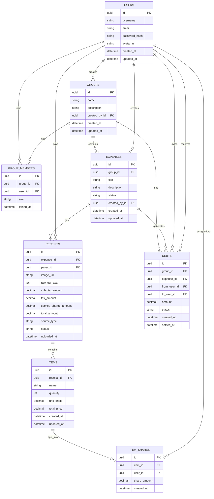

# DFS Database ERD Draft

## Purpose

This document defines the initial database structure for the DFS project

## Core Design

DFS uses the following entities:

- users
- groups
- group_members
- expenses
- receipts
- items
- item_shares
- debts

## Business Flow

Users -> Groups -> Expenses -> Receipts -> Items -> ItemShares -> Debts

## ERD Diagram

## Table Explanations

### users

The users table stores the basic account information of each user in the DFS system.

#### Important Fields

- id: unique identifier of the user.
- username: display name shown in the frontend
- email: user email, mainly for login
- password_hash: hashed password. The system should not store raw passwords.
- avatar_url: optional profile image URL used by the frontend.
- created_at and updated_at: timestamps for tracking creation and updates.

#### Relationships

A user can create groups, join groups, create expenses, pay receipts, receive item shares, and appear in debt records.

#### Example

A user named Alice can create a dinner group, pay for a receipt, and later receive money from other group members.

### groups

The groups table stores expense-sharing groups.

#### Important Fields

- id: unique identifier of the group.
- name: group name, such as COM3 Lunch.
- description: optional description of the group.
- created_by_id: the user who created the group.
- created_at and updated_at: timestamps for tracking creation and updates.

#### Relationships

Each group is created by a user.
Each group can have many members through group_members.
Each group can contain many expenses and debts.

#### Example

A group called NUS Dinner, may contain Alice, Bob, Cindy as members.

### group_members

The group_members table connects users and groups.

#### Important Fields

- id: unique identifier of the membership record.
- group_id: the group that the user belongs to.
- user_id: the user who joined the group.
- role: the user’s role in the group, such as owner or member.
- joined_at: time when the user joined the group.

#### Relationships

This table handles the many-to-many relationship between users and groups.

#### Example

If Alice and Bob are both in the NUS Dinner group, there will be two records in group_members.

### expenses

The expenses table stores one expense session inside a group.

#### Important Fields

- id: unique identifier of the expense.
- group_id: the group that this expense belongs to.
- title: short title of the expense, such as Friday Hotpot.
- description: optional details.
- status: current state of the expense, such as draft, confirmed, or settled.
- created_by_id: the user who created this expense session.
- created_at and updated_at: timestamps for tracking creation and updates.

#### Relationships

Each expense belongs to one group.  
Each expense is created by one user.  
Each expense can contain multiple receipts.

#### Example

A group may have an expense called Friday Hotpot, and this expense may include one receipt for food and another receipt for drinks.

### receipts

The receipts table stores receipt-level information. A receipt can come from manual entry in Milestone 1 or OCR upload in Milestone 2.

#### Important Fields

- id: unique identifier of the receipt.
- expense_id: the expense session that this receipt belongs to.
- payer_id: the user who paid for this receipt.
- image_url: optional URL of the uploaded receipt image.
- raw_ocr_text: raw text extracted by OCR. This can be empty for manual entry.
- subtotal_amount: total before tax and service charge.
- tax_amount: tax amount.
- service_charge_amount: service charge amount.
- total_amount: final receipt total.
- source_type: whether this receipt is created manually or from OCR.
- status: receipt processing state.
- uploaded_at: time when the receipt was uploaded or created.

#### Relationships

Each receipt belongs to one expense.
Each receipt has one payer.
Each receipt can contain many items.

#### Example

Alice pays for a receipt with total amount 36.50. The receipt belongs to the Friday Hotpot expense.

### items

The items table stores individual items under a receipt.

#### Important Fields

- id: unique identifier of the item.
- receipt_id: the receipt that this item belongs to.
- name: item name, such as Chicken Rice.
- quantity: number of units.
- unit_price: price of one unit.
- total_price: total price of this item.
- created_at and updated_at: timestamps for tracking creation and updates.

#### Relationships

Each item belongs to one receipt.
Each item can be split among multiple users through item_shares.

#### Example

A receipt may contain an item called Pizza with total_price = 24.00.

### item_shares

The item_shares table stores how each item is split among users.

#### Important Fields

- id: unique identifier of the item share record.
- item_id: the item being split.
- user_id: the user assigned to this item.
- share_amount: the amount this user should pay for this item.
- created_at: time when this share record was created.

#### Relationships

Each item can have many item shares.
Each user can be assigned many item shares.

#### Example

If a 24.00 pizza is split equally between Alice and Bob, there will be two records:

    Alice: 12.00
    Bob: 12.00

This table supports both equal and unequal item splitting.

### debts

The debts table stores the final payment instructions after calculating the expense split.

#### Important Fields

- id: unique identifier of the debt record.
- group_id: the group where this debt belongs.
- expense_id: the expense that generated this debt. This can be optional for future group-level optimisation.
- from_user_id: the user who needs to pay.
- to_user_id: the user who should receive money.
- amount: amount to be paid.
- status: current state of the debt, such as pending, settled, or cancelled.
- created_at: time when the debt was created.
- settled_at: time when the debt was settled.

#### Relationships
Each debt belongs to one group.
A debt may be generated by one expense.
Both from_user_id and to_user_id refer to users.

#### Example
If Bob owes Alice 10.50, the record will be:

    from_user_id = Bob
    to_user_id = Alice
    amount = 10.50

This table will later connect to the Minimum Cash Flow algorithm, because the final system needs to minimise redundant transactions between users.

## Design Notes for Future API Contract

- Frontend should use `user_id`, `group_id`, `expense_id`, `receipt_id`, and `item_id` instead of names when sending API requests.
- User-facing names such as `username`, `group name`, and `item name` are for display.
- `receipts.source_type` should support both `manual` and `ocr`.
- `expenses.status`, `receipts.status`, and `debts.status` should use predefined string values.
- Money-related fields should use decimal values and be rounded to two decimal places.
- `users.email` should be unique.
- `group_members` should prevent duplicate membership records for the same user in the same group.
- `item_shares` should prevent duplicate share records for the same user on the same item.